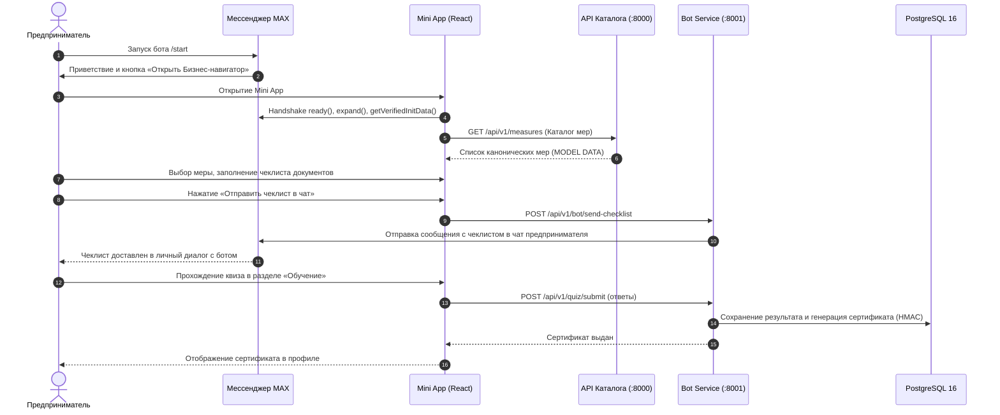
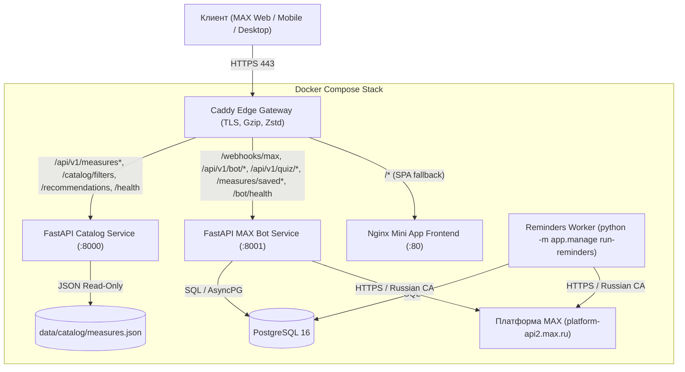

# 🐾 ZVERY — Бизнес-навигатор для платформы MAX

Цифровой помощник и интерактивный навигатор по мерам господдержки, налогам и сервисам для предпринимателей в экосистеме мессенджера MAX.

- **Production URL:** [https://zverybot.ru](https://zverybot.ru)
- **MAX Bot:** [@t826_hakaton_max_bot](https://max.ru/t826_hakaton_max_bot)
- **Ветка релиза:** `release/zvery-hackathon-2026`

---

## 1. Назначение проекта

**ZVERY Бизнес-навигатор** создан для решения ключевой боли начинающих и действующих предпринимателей — сложности навигации по сотням разрозненных мер государственной поддержки, налоговых режимов и бюрократических процедур.

Сервис объединяет:
1. **Каталог мер господдержки** с прозрачной фильтрацией по регионам (Казань, Москва, Санкт-Петербург), отраслям и юридическим формам.
2. **Интерактивные чеклисты** сбора документов и подачу заявки с возможностью отправки структурированного чеклиста прямо в чат MAX.
3. **Налоговый калькулятор** для сравнения режимов (НПД, УСН 6%, УСН 15%, АУСН, ОСНО) и расчёта квартальных авансов.
4. **Обучающий трек и квиз** с серверной проверкой знаний и выпуском памятного цифрового сертификата.
5. **Фоновые напоминания** о предстоящих мероприятиях, встречах и дедлайнах подачи заявок в личный чат MAX.

---

## 2. Основной сценарий использования



1. **Запуск и онбординг:** Пользователь открывает чат-бота `@t826_hakaton_max_bot` в MAX и нажимает кнопку открытия Mini App. Приложение встречает анимированным 3D-маскотом и интерактивным онбордингом.
2. **Подбор мер поддержки:** Пользователь фильтрует меры по своему городу и категории («Гранты», «Займы», «Субсидии», «Лизинг»). В карточке отображаются условия, требования к бизнесу, оператор и статус данных.
3. **Работа с чеклистами:** Внутри карточки меры предприниматель отмечает галочками собранные документы и по одной кнопке отправляет весь чеклист себе в личный диалог с ботом в MAX.
4. **Расчёт налогов и сервисы:** В разделе сервисов доступен интерактивный калькулятор налогов с выбором ставки, расчётом взносов и налоговой базы.
5. **Проверка знаний и сертификация:** В разделе «Обучение» предприниматель проходит квиз из 5 вопросов по базовым правилам ведения бизнеса. При успешном результате (>= 70%) сервер генерирует памятный сертификат с HMAC-подписью.
6. **Напоминания:** Пользователь подписывается на напоминания о мероприятиях — фоновый воркер `reminders` автоматически отправляет уведомление в MAX за 1 день до события.

---

## 3. Архитектура решения



Проект состоит из 6 контейнеров:
- **`web`:** Сборка React 19 + TypeScript + Vite, раздаваемая через легковесный образ Nginx с настроенным SPA-роутингом.
- **`api`:** Высокопроизводительный асинхронный сервис на FastAPI, обслуживающий каталог мер и рекомендации.
- **`bot`:** Сервис интеграции с MAX, реализующий вебхуки, валидацию `initData`, отправку чеклистов и проверку квизов.
- **`reminders`:** Фоновый планировщик, опрашивающий базу данных каждые 60 секунд и уведомляющий пользователей о событиях.
- **`db`:** PostgreSQL 16 с персистентным томом данных и проверками готовности `healthcheck`.
- **`caddy`:** Входной шлюз с автоматическим получением и продлением Let's Encrypt TLS-сертификатов.

---

## 4. Порты и сетевая модель

| Сервис | Контейнерный порт | Внешний порт (Prod) | Внешний порт (Dev Override) | Назначение |
|---|---|---|---|---|
| **Caddy** | 80, 443 | **80, 443** | — | Публичный HTTPS шлюз |
| **API** | 8000 | — | 8000 | Внутренний API каталога |
| **Bot** | 8001 | — | 8001 | Внутренний Bot API и вебхуки |
| **Web** | 80 | — | 8080 | Статика Mini App |
| **DB** | 5432 | — | 5432 | База данных PostgreSQL |
| **Reminders**| — | — | — | Фоновый процесс без портов |

> В production-окружении наружу открыты **исключительно порты 80 и 443**. База данных и сервисы изолированы во внутренней Docker-сети `internal`.

---

## 5. Зависимости

- **Контейнеризация:** Docker Engine 24+ и Docker Compose v2.20+
- **Frontend стек:** React 19, TypeScript 5.8, Vite 8.3, React Router 7, Lucide React
- **Backend стек:** Python 3.12, FastAPI, Uvicorn, Pydantic 2, AsyncPG, HTTPX
- **База данных:** PostgreSQL 16 Alpine
- **Сетевой шлюз:** Caddy 2 Alpine

---

## 6. Внешние интеграции

1. **MAX Bot Platform API (`https://platform-api2.max.ru`):**
   - Webhook прием событий: `bot_started`, `message_created`, `message_callback`.
   - Отправка интерактивных сообщений, кнопок и карточек в чаты пользователей.
   - В контейнеры `bot` и `reminders` предустановлены доверенные сертификаты Минцифры РФ (`russian_trusted_root_ca.pem`, `russian_trusted_sub_ca.pem`) для работы с TLS-шлюзом MAX.
2. **MAX Mini App Bridge (`window.WebApp` / `window.MAXBridge`):**
   - Двусторонний handshake, раскрытие экрана на весь размер (`expand()`).
   - Использование безопасного `initData` для авторизации запросов без раскрытия пользовательских данных.
   - Тактильный отклик (Haptic Feedback) на действия пользователя.
   - Поддержка нативной кнопки возврата (`BackButton`).

---

## 7. Модельные данные

В соответствии с правилами хакатона и политикой честности данных:
- Все демонстрационные меры хранятся в единственном источнике истины: [`data/catalog/measures.json`](data/catalog/measures.json).
- Каждая запись снабжена обязательными метаданными:
  - `data_status: "MODEL DATA"`
  - `freshness_status: "model"`
  - `source_name: "MODEL DATA"`
  - `source_url: "https://example.invalid/..."`
- Фронтенд явно отображает дату последней проверки и маркировку демонстрационных данных в шторке детального просмотра.

---

## 8. Запуск проекта через Docker

### Подготовка конфигурации
В корне проекта создайте или проверьте файл `.env` на основе шаблона:
```bash
cp .env.example .env
```
*(Для локального тестирования можно использовать готовый рабочий `.env`).*

### Запуск в Production-режиме (через Caddy Gateway)
```bash
export APP_ENV_FILE=.env
docker compose --env-file "$APP_ENV_FILE" -f infra/compose.yaml up --build -d
```

### Запуск в режиме разработки (прямые порты на 127.0.0.1)
```bash
export APP_ENV_FILE=.env
docker compose --env-file "$APP_ENV_FILE" -f infra/compose.yaml -f infra/compose.dev.yaml up --build -d
```
После запуска будут доступны:
- Mini App: `http://localhost:8080`
- API каталога: `http://localhost:8000/docs`
- Bot API: `http://localhost:8001/docs`

### Остановка и повторный запуск
```bash
# Остановка контейнеров
docker compose --env-file "$APP_ENV_FILE" -f infra/compose.yaml stop

# Повторный запуск
docker compose --env-file "$APP_ENV_FILE" -f infra/compose.yaml up -d

# Полная остановка с удалением контейнеров
docker compose --env-file "$APP_ENV_FILE" -f infra/compose.yaml down
```

---

## 9. Переменные окружения (.env)

| Переменная | Обязательность | Назначение |
|---|---|---|
| `APP_ENV` | Да | Режим окружения (`production` или `development`) |
| `DATABASE_URL` | Да | URL подключения к PostgreSQL (`postgresql://user:pass@db:5432/dbname`) |
| `POSTGRES_DB` | Да | Имя базы данных PostgreSQL |
| `POSTGRES_USER` | Да | Имя пользователя базы данных |
| `POSTGRES_PASSWORD` | Да | Пароль к базе данных |
| `MAX_BOT_TOKEN` | Да | Токен авторизации бота из личного кабинета MAX |
| `MAX_API_BASE_URL` | Да | Базовый URL API MAX (`https://platform-api2.max.ru`) |
| `MAX_BOT_USERNAME` | Да | Имя пользователя бота в MAX (`t826_hakaton_max_bot`) |
| `MAX_WEBHOOK_SECRET` | Да | Секретный ключ для валидации вебхуков от MAX |
| `PUBLIC_DOMAIN` | Да | Доменное имя для выпуска TLS (`zverybot.ru`) |
| `PUBLIC_BASE_URL` | Да | Публичный адрес шлюза (`https://zverybot.ru`) |
| `MAX_LAUNCH_MAX_AGE_SECONDS` | Нет | Время жизни подписи initData в секундах (по умолч. 3600) |
| `CERTIFICATE_SIGNING_SECRET` | Да | Секретный ключ для HMAC-подписи сертификатов квиза |
| `QUIZ_ANSWER_KEY_JSON` | Да | JSON с правильными ответами для серверной проверки квиза |
| `QUIZ_PASS_SCORE` | Нет | Проходной процент правильных ответов (по умолч. 70) |
| `MAX_CA_BUNDLE_PATH` | Нет | Путь к бандлу российских корневых сертификатов |
| `REMINDER_POLL_SECONDS` | Нет | Периодичность опроса напоминаний (по умолч. 60) |
| `REMINDER_LEAD_DAYS` | Нет | За сколько дней отправлять напоминание (по умолч. 1) |

---

## 10. Тестовый сценарий для жюри

### 1. Проверка состояния сервисов (Health Checks)
```bash
# 1. Health API каталога
curl -s https://zverybot.ru/health
# Ожидаемый ответ:
# {"status":"ok","version":"0.1.0"}

# 2. Health Bot сервиса и базы данных
curl -s https://zverybot.ru/bot/health
# Ожидаемый ответ:
# {"status":"ok","service":"bot","version":"0.1.0","max_configured":true,"webhook_configured":true,"database_ready":true}
```

### 2. Проверка публичного каталога мер
```bash
# 1. Получение доступных фильтров
curl -s https://zverybot.ru/api/v1/catalog/filters

# 2. Получение полного списка мер
curl -s https://zverybot.ru/api/v1/measures

# 3. Получение конкретной меры
curl -s https://zverybot.ru/api/v1/measures/demo-kazan-agro-001
```

### 3. Рекомендательный сценарий
```bash
curl -s -X POST https://zverybot.ru/api/v1/recommendations \
  -H "Content-Type: application/json" \
  -d '{"region":"kazan","role":"ip","tax_mode":"usn6","sector":"agro","goal":"support"}'

# Ожидаемый ответ:
# {
#   "items": [
#     {
#       "id": "demo-kazan-agro-001",
#       "title": "Грант «Агростартап» (Республика Татарстан)",
#       "data_status": "MODEL DATA"
#     }
#   ],
#   "catalog_version": "demo-2026-09-19"
# }
```

### 4. Проверка обработки некорректных запросов (Negative tests)
```bash
# Несуществующая мера -> 404
curl -s https://zverybot.ru/api/v1/measures/unknown-measure-id
# Ожидаемый ответ:
# {"error":{"code":"measure_not_found","message":"Мера не найдена","request_id":"..."}}

# Недопустимый налоговый режим -> 422
curl -s -X POST https://zverybot.ru/api/v1/recommendations \
  -H "Content-Type: application/json" \
  -d '{"region":"kazan","role":"ip","tax_mode":"fake_tax"}'
# Ожидаемый ответ:
# {"error":{"code":"validation_error","message":"Некорректный запрос","request_id":"..."}}
```

### 5. Проверка сквозного пользовательского пути в MAX
1. Перейдите в мессенджер MAX к боту: [@t826_hakaton_max_bot](https://max.ru/t826_hakaton_max_bot).
2. Нажмите `/start` и затем кнопку **«Открыть Бизнес-навигатор»**.
3. В Mini App откройте раздел **«Гранты»**, выберите меру и отправьте чеклист в чат.
4. Проверьте поступление сообщения в чате MAX с деталями меры и списком документов.
5. Перейдите в раздел **«Обучение»**, пройдите квиз и получите цифровой сертификат с HMAC-верификацией.

---

## 11. Известные ограничения

1. **Сертификаты квиза:** Сертификаты генерируются бэкендом с криптографической HMAC-подписью для защиты от подделки в браузере, однако носят поощрительный информационный характер и не являются дипломами государственного образца.
2. **Шаблоны документов:** Раздел «Шаблоны документов» демонстрирует правила заполнения и интерактивные чеклисты; скачивание бинарных PDF-файлов будет подключено при интеграции с ведомственными порталами.
3. **Модельные данные:** Меры поддержки в демонстрационном каталоге имеют статус `MODEL DATA`, что явно указано в UI.

---

## 12. Метаданные релиза

- **Ветка:** `release/zvery-hackathon-2026`
- **Commit:** `17786d2` (`release/zvery-hackathon-2026`)
- **Команда ZVERY:** Хакатон MAX 2026
