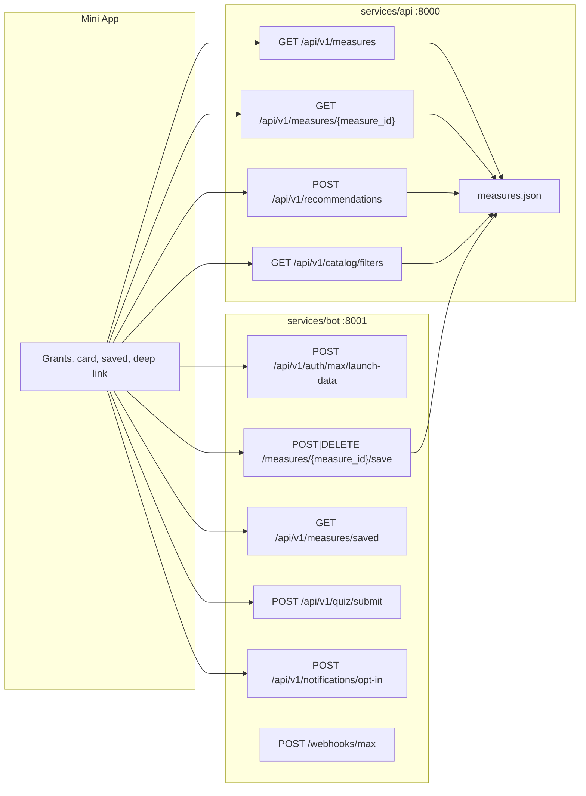

# ADR: Один каталог мер и один контракт `/api/v1`

- **Status:** Accepted
- **Date:** 2026-09-27
- **Scope:** фаза C1+C2. Не Caddy, Vite, nginx, онбординг UI, webhook, lockfile, коммиты и push.

## Context

Клиент [`apps/miniapp/src/api/client.ts`](../../apps/miniapp/src/api/client.ts) вызывает `GET /api/v1/measures`, а [`services/api/app/main.py`](../../services/api/app/main.py) этот путь не регистрирует. Карточка по ID, рекомендации и закладки бота читают [`data/catalog/measures.json`](../../data/catalog/measures.json). Параллельно [`apps/miniapp/src/api/fixtures.ts`](../../apps/miniapp/src/api/fixtures.ts) и `GRANTS` в [`apps/miniapp/src/data.ts`](../../apps/miniapp/src/data.ts) держат другие ID, суммы и статус `CONFIRMED`. Deep link `startapp=measure` открывает `GRANTS[0]`. `goal` и `sector` уже фильтруют в коде рекомендаций, но контракт описывает их как свободные строки. `npd` и `ausn` нельзя подменять `none` или УСН.

`packages/contracts` в репозитории пуст. Нормативные файлы этой фазы: [`docs/API_CONTRACT.md`](../API_CONTRACT.md), [`openapi.yaml`](../../openapi.yaml), [`DATA-API.yaml`](../../DATA-API.yaml).

## Decision

Один каталог и одна версия API. Новые возможности добавляются полями и одним маршрутом коллекции, не префиксом `/api/v2` и не `/saved-measures`.

1. `services/api` на `:8000` отдаёт только каталог: `/health`, `/api/v1/catalog/filters`, `GET /api/v1/measures`, `GET /api/v1/measures/{measure_id}`, `POST /api/v1/recommendations`.
2. `services/bot` на `:8001` оставляет уже существующие пользовательские маршруты: launch data, `POST|DELETE /api/v1/measures/{measure_id}/save`, `GET /api/v1/measures/saved`, quiz, opt-in, `/webhooks/max`, свой `/health`.
3. Прямой `:8000` не реализует bot-маршруты. `GET /api/v1/measures/saved` на API — это неизвестный ID `saved` и ответ 404 `measure_not_found`, не список закладок.
4. `GET /api/v1/measures` возвращает JSON-массив тех же объектов, что и карточка. Не фикстуры и не обёртку `{items}`.
5. `goal` и `sector`, если переданы, фильтруют равенством по полям каталога. Значение вне каталога — 422 `validation_error`, а не пустой список и не подмена. Пропуск поля означает «не фильтровать».
6. `tax_mode` — закрытый enum `npd | usn6 | usn15 | ausn | osno | none`. `npd` не равен `none`. `ausn` не равен `usn6` или `usn15`. Несовпадение валидного режима с записями — `items: []`.
7. В каталоге остаётся одна модельная запись `demo-kazan-support-001` (`kazan`, `MODEL DATA`). Для `moscow` и `spb` записей нет: это блокер контента, фиктивные строки не добавляются.
8. `example.invalid` не является кликабельным официальным источником. Суммы, дедлайны и «проверено» не выдумываются. `data_status` виден на карточке.
9. Неизвестный ID не подменяется первой записью.

Нормативная формулировка семантики фильтров — в [`docs/API_CONTRACT.md`](../API_CONTRACT.md), раздел «Семантика region / role / tax_mode / goal / sector».

## Topology



Caddy в этой фазе не меняется. Уже существующие правила отправляют `GET /api/v1/measures` в API через `handle /api/*`, а `/api/v1/measures/saved` и `.../save` — в bot более ранними `handle`. Это не реализация фазы C3.

## Failure semantics

- Успешные ошибки — только `{"error":{"code","message","request_id"}}` без `detail`.
- `request_id` генерирует сервер. Заголовок `X-Request-ID` не доверяется.
- 404 `measure_not_found`: нет записи с этим ID. Тело не содержит чужой `id`.
- 422 `validation_error`: сломанное тело, неизвестные `region` / `role` / `tax_mode` / `goal` / `sector`.
- 401 на bot-маршрутах: нет или неверен `X-Max-Init-Data`. Webhook: `X-Max-Bot-Api-Secret`.
- Каталог, не прошедший схему, не отдаётся как успешный список. API отвечает 500 `catalog_invalid` с тем же envelope, без текста исключения.
- Пустой `items` при валидном запросе — честный ноль, не повод подставить другую меру.

## Alternatives considered

- Вторая версия `/api/v2` или параллельный `/saved-measures`: отвергнуто, клиент и bot уже на `/measures/{id}/save` и `/measures/saved`.
- Отдать фикстуры из `GET /api/v1/measures`: отвергнуто, это второй каталог с другими ID и ложным `CONFIRMED`.
- Убрать `goal` и `sector` из запроса: отвергнуто, [`recommendations()`](../../services/api/app/main.py) уже фильтрует ими. Контракт должен признать фильтр, а не прятать его.
- Подменить `npd` → `none` и `ausn` → `usn6`, чтобы самозанятый видел демо-запись: отвергнуто.
- Дописать фиктивные меры Москвы и Санкт-Петербурга: отвергнуто. Дыра контента фиксируется в `content_gaps` и в отчёте.
- Общий Python-пакет в `packages/contracts`: каталога пакета нет, новый пакет не заводится в этой фазе.

## Consequences

- Клиент коллекции обязан принимать массив. Обёртка сломает [`getAllMeasures()`](../../apps/miniapp/src/api/client.ts) и [`honesty-regressions.mjs`](../../apps/miniapp/scripts/honesty-regressions.mjs).
- Онбординг по-прежнему может хранить `goal` `start|grants|growth|education`. Эти слова не являются целями каталога и не алиасятся. Их отправка в рекомендации даст 422, пока фаза D не свяжет экран с каноническими `goal`. Сам экран онбординга не меняется.
- Добавление настоящей меры Москвы или Санкт-Петербурга обязано пройти ту же схему и обновить снимок `content_gaps` в тесте. Модельная запись не помечается `CONFIRMED`.

## Implementation spec

### Каталог

Файл [`data/catalog/measures.json`](../../data/catalog/measures.json) не пополнять. Единственная запись:

- `id`: `demo-kazan-support-001`
- `region`: `kazan`
- `data_status`: `MODEL DATA`
- `freshness_status`: `model`
- `source_url`: `https://example.invalid/model-data`
- `deadline`: `null`
- без суммы

Схема, которую проверяют загрузчик и тест:

- `id` уникален, regex `^[a-z0-9]+(?:-[a-z0-9]+)*$`, не из резерва `saved`, `save`, `filters`, `recommendations`.
- `region` ∈ `kazan|moscow|spb`.
- `roles` — непустой уникальный набор из `ip|self_employed|llc`.
- `tax_modes` — непустой уникальный набор из `npd|usn6|usn15|ausn|osno|none`.
- `npd` допустим только если в `roles` есть `self_employed`.
- `sector` и `goal` — непустые токены `^[a-z0-9_]+$`.
- `documents` — непустой массив непустых строк.
- `deadline` — `null` или `YYYY-MM-DD`.
- `last_checked` — `YYYY-MM-DD`.
- `source_url` — `http` или `https` с hostname.
- `MODEL DATA` требует `freshness_status=model`, `source_name=MODEL DATA` и hostname `example.invalid` или суффикс `.invalid`.
- `CONFIRMED` запрещён при hostname `.invalid`, при `freshness_status=model` и при `source_name=MODEL DATA`.
- `data_status` только `MODEL DATA` или `CONFIRMED`. Значения `VERIFIED` нет.

### API

В [`services/api/app/main.py`](../../services/api/app/main.py):

- Константа `CATALOG_VERSION = "demo-2026-09-19"` — единственное место версии. Не менять строку: её ждёт текущий тест рекомендаций и клиентский regression.
- `TaxMode = Literal["npd","usn6","usn15","ausn","osno","none"]`.
- `goal` и `sector` остаются опциональными. После загрузки каталога значение вне множества полей каталога даёт `ApiError(422, "validation_error", "Некорректный запрос")`.
- Никакой функции нормализации режима.
- `GET /api/v1/measures` объявить рядом с карточкой и вернуть `load_catalog()`.
- `GET /api/v1/catalog/filters` сохранить `regions`, `roles`, `tax_modes`, `sectors` и добавить `goals`, `accepted_tax_modes`, `content_gaps`, `catalog_version`.
  - `regions` — всегда три кода продукта.
  - `tax_modes` и `goals` / `sectors` — значения, которые реально есть в записях.
  - `accepted_tax_modes` — закрытый enum, отсортированный.
  - `content_gaps` — коды регионов без единой записи, отсортированные.
- Неизвестный ID по-прежнему `ApiError(404, "measure_not_found", "Мера не найдена")`.
- Невалидный каталог: `ApiError(500, "catalog_invalid", "Каталог недоступен")`.

### Bot

Маршруты [`services/bot/app/main.py`](../../services/bot/app/main.py) не переименовывать. Существование ID по-прежнему через [`services/bot/app/catalog.py`](../../services/bot/app/catalog.py) и тот же JSON. Webhook и меню не трогать.

### Контрактные файлы

- [`openapi.yaml`](../../openapi.yaml): те же пути, у каждой операции `x-zvery-service: api|bot`. Серверы `:8000`, `:8001` и публичный gateway описать раздельно. Схемы ответа, auth-заголовки и `ErrorEnvelope` обязательны. Коллекция мер — `type: array`. Запрещены `/api/v2` и `/api/v1/saved-measures`.
- [`DATA-API.yaml`](../../DATA-API.yaml): `api_base_url: http://127.0.0.1:8000`, `bot_base_url: http://127.0.0.1:8001`. Проверки API не адресовать на bot-пути. `GET /bot/health` не выдавать за прямой порт API. Прямой bot health — `GET /health` на `:8001`.
- [`apps/miniapp/src/types/api.ts`](../../apps/miniapp/src/types/api.ts): закрытые union без `| string` и без `VERIFIED`. `CatalogFiltersResponse` включает новые поля фильтров.

### Production-путь Mini App

Не менять визуальную систему и [`OnboardingSheet.tsx`](../../apps/miniapp/src/components/OnboardingSheet.tsx).

- [`fixtures.ts`](../../apps/miniapp/src/api/fixtures.ts): не экспортировать второй набор мер. Пустой массив и комментарий, что источник — серверный каталог.
- [`App.tsx`](../../apps/miniapp/src/App.tsx): не импортировать `GRANTS`. Payload `measure` без ID не открывает карточку. Payload `measure_<id>` запрашивает `getMeasure(id)` и при ошибке не подставляет другую меру.
- Экран грантов, поиск и блок сохранённых в [`Other.tsx`](../../apps/miniapp/src/pages/Other.tsx) не читают `GRANTS`. Список — `getAllMeasures()`. Регион города без записей — явный блокер, не чужие меры и не суммы. Ошибка сети не заменяется локальными мерами.
- [`MeasureDetailSheet.tsx`](../../apps/miniapp/src/components/MeasureDetailSheet.tsx): бейдж `data_status`, документы и оператор из записи. Нет плашки «ПРОВЕРЕНО · 2026», нет выдуманных документов, суммы и «приём открыт». Нет ссылки на мойбизнес.рф, если её нет в записи.
- [`store.tsx`](../../apps/miniapp/src/store.tsx): пустой набор сохранённых по умолчанию. Локальные `young` и `micro` не показывать как меры.
- [`maxBridge.ts`](../../apps/miniapp/src/lib/maxBridge.ts): `officialSourceHref` возвращает `null` для не-`CONFIRMED`, `freshness_status=model` и hostname `.invalid`. [`MeasureDetailModal.tsx`](../../apps/miniapp/src/components/measures/MeasureDetailModal.tsx) и [`ChecklistView.tsx`](../../apps/miniapp/src/components/checklist/ChecklistView.tsx) не вызывают `openExternalUrl` для такого адреса и не пишут «проверено» для модельной записи.

Алфавит deep link MAX: `A-Za-z0-9_-`. ID `demo-kazan-support-001` даёт payload `measure_demo-kazan-support-001`.

### Тесты, которые нужно добавить, не удаляя текущие

- [`services/api/tests/test_catalog_contract.py`](../../services/api/tests/test_catalog_contract.py): схема файла, уникальные ID, снимок «1 модельная запись, gaps moscow и spb», `GET /api/v1/measures` равен файлу, неизвестный ID — 404 envelope и тело не содержит ID первой записи, `GET /api/v1/measures/saved` на API — 404 `measure_not_found`, `npd` не возвращает запись с `none`, `ausn` не возвращает запись с `usn6`, неизвестный `goal` — 422, валидный `goal=support` оставляет запись, пропуск `goal` не отфильтровывает её.
- [`services/api/tests/test_contract_drift.py`](../../services/api/tests/test_contract_drift.py): пути FastAPI, текст OpenAPI, DATA-API и API_CONTRACT совпадают по списку маршрутов; нет `/saved-measures` и `/api/v2`; в `api.ts` есть закрытый `TaxMode`; production-файлы `App.tsx`, `Other.tsx`, `store.tsx` не содержат `GRANTS` и `FIXTURE_MEASURES`; лист не содержит «ПРОВЕРЕНО».
- [`services/bot/tests/test_bot.py`](../../services/bot/tests/test_bot.py): сохранить существующие тесты; добавить 404 envelope на сохранение неизвестного ID при валидном launch data, тело без `demo-kazan-support-001`.

### Проверка

Не удалять логи. Писать вывод команд в:

- `/tmp/maxhackathon-c-api-pytest.log`
- `/tmp/maxhackathon-c-bot-pytest.log`
- `/tmp/maxhackathon-c-build.log`

Интерпретатор: `/tmp/maxhackathon-venv`.

```bash
cd services/api && /tmp/maxhackathon-venv/bin/python -m pytest -q --tb=short
cd services/bot && /tmp/maxhackathon-venv/bin/python -m pytest -q --tb=short
cd apps/miniapp && npm run build
```

Коммит не создавать.

## Rollback

Удалить `GET /api/v1/measures` и новые поля фильтров одним откатом коммита этой фазы. Каталог JSON не мигрирует: схема файла не менялась. Закладки bot остаются на прежних путях.
