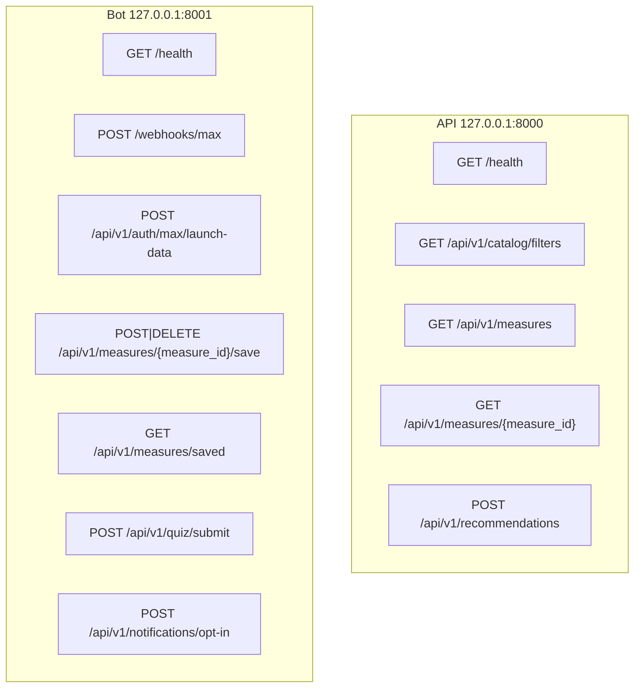

# API contract

Один контракт `/api/v1`. Второй версии, префикса `/saved-measures` и второго каталога нет. Источник записей — только [`data/catalog/measures.json`](../data/catalog/measures.json). Нормативное решение: [`docs/ADR/0001-single-catalog-contract.md`](ADR/0001-single-catalog-contract.md).

Даты — `YYYY-MM-DD` или ISO-8601 там, где поле временное. Неизвестные поля запроса не используются как повод вернуть чужую меру.

## Порты



`127.0.0.1:8000` не обслуживает маршруты bot. `GET /api/v1/measures/saved` на API совпадает с карточкой ID `saved` и возвращает 404 `measure_not_found`. Список закладок существует только на bot `:8001`.

Локальные порты из [`infra/compose.dev.yaml`](../infra/compose.dev.yaml): API `127.0.0.1:8000`, bot `127.0.0.1:8001`, nginx Mini App `127.0.0.1:8080`. Vite dev слушает `127.0.0.1:3000` и повторяет разделение gateway: точные bot-пути (`/webhooks/max`, launch-data, quiz, opt-in, `/measures/saved`, `/measures/{id}/save`, `/bot/health` → bot `/health`) идут на `:8001` раньше общего `/api` и `/health` на `:8000`. Карточка и коллекция мер остаются на API.

Публичный Caddy слушает 80/443. До общего `handle /api/*` и `/health` он отправляет в bot те же точные пути. Nginx внутри web отдаёт SPA (`/grants`, `/profile`, `/assistant` и прямой refresh → `index.html`) и не превращает отсутствующий `/api/*`, `/health`, `/bot/health` или `/webhooks/*` в HTML 200.

`/webhooks/max` вызывает только MAX. Это не браузерный API.

## Auth

- Каталог API: без сессии и без `X-Max-Init-Data`.
- `POST /api/v1/auth/max/launch-data`: тело `{init_data: string}`. Заголовок не требуется.
- Остальные пользовательские маршруты bot: заголовок `X-Max-Init-Data` с исходной строкой MAX. Неверное или пустое значение — 401, код `launch_data_required` либо `invalid_launch_data`.
- Webhook: заголовок `X-Max-Bot-Api-Secret`. Неверное значение — 401 `invalid_webhook_secret`. Пустой серверный секрет — 503 `webhook_not_configured`.
- `X-Request-ID` клиента игнорируется. `request_id` в ответе создаёт сервер.

## Error envelope

Все отказы API и bot:

```json
{"error":{"code":"measure_not_found","message":"Мера не найдена","request_id":"server-generated"}}
```

Объект верхнего уровня содержит только `error`. Внутри ровно `code`, `message`, `request_id`. Поля `detail` нет. Тело 404 не содержит ID другой меры и не подставляет первую запись каталога.

Коды этой фазы:

| HTTP | code | Кто |
| --- | --- | --- |
| 404 | `measure_not_found` | API карточка; bot save, если ID нет в каталоге |
| 422 | `validation_error` | сломанное тело или значение вне enum / вне каталога |
| 401 | `launch_data_required`, `invalid_launch_data`, `invalid_webhook_secret` | bot |
| 500 | `internal_error`, `catalog_invalid` | необработанный сбой; каталог не прошёл схему |
| 503 | `webhook_not_configured`, `quiz_not_configured`, `quiz_config_invalid`, `certificate_signing_not_configured` | bot |

## Семантика region / role / tax_mode / goal / sector

`region` — `kazan | moscow | spb`. `role` — `ip | self_employed | llc`. `tax_mode` — закрытый enum `npd | usn6 | usn15 | ausn | osno | none`: `npd` это только НПД и не заменяется на `none` или УСН, `ausn` это только АУСН и не заменяется на `usn6` или `usn15`, `none` значит «режим не выбран», а не синоним НПД. `goal` и `sector` — реальные фильтры равенства по полям записи, а не декоративные параметры: переданное значение обязано совпасть с полем каталога, значение вне каталога даёт 422 `validation_error` и не подменяется ближайшим, пропуск поля отключает этот фильтр. Несовпадение валидных `region`, `role` или `tax_mode` с записями даёт `items: []`, а не чужую меру. Сейчас в каталоге одна модельная запись региона `kazan`; `moscow` и `spb` перечислены в `content_gaps`, потому что записей для них нет.

Цели онбординга `start | grants | growth | education` не являются значениями каталога и в рекомендации не алиасятся. Экран онбординга этой фазой не меняется.

## `GET /health`

API `:8000`: `{"status":"ok","version":"0.1.0"}`.

Bot `:8001`: `status`, `service` = `bot`, `version`, `max_configured`, `webhook_configured`, `database_ready`. `database_ready: false` — это HTTP 503 и `status: not_ready`, не готовый сервис. Прямой порт bot не имеет `/bot/health`: этот путь есть только у gateway и Vite, которые снимают префикс `/bot` и вызывают bot `GET /health`.

## `GET /api/v1/catalog/filters`

Ответ:

| Поле | Смысл |
| --- | --- |
| `regions` | всегда `kazan`, `moscow`, `spb` |
| `roles` | роли, встретившиеся в записях |
| `tax_modes` | режимы, встретившиеся в записях, не весь enum |
| `sectors` | отрасли записей |
| `goals` | цели записей |
| `accepted_tax_modes` | закрытый enum, отсортированный |
| `content_gaps` | регионы из `regions` без единой записи |
| `catalog_version` | `demo-2026-09-19` |

## `GET /api/v1/measures`

Массив тех же объектов, что `GET /api/v1/measures/{measure_id}`, в порядке файла. Не фикстуры фронтенда. Пустой каталог был бы `[]`, текущий файл пустым не является.

Поля записи:

| Поле | Правило |
| --- | --- |
| `id` | уникальный токен `[a-z0-9-]+`, не `saved`, `save`, `filters`, `recommendations` |
| `title`, `operator`, `eligibility`, `disclaimer` | непустые строки |
| `region` | enum региона |
| `roles`, `tax_modes` | непустые массивы своих enum; `npd` только вместе с `self_employed` |
| `sector`, `goal` | токены `[a-z0-9_]+` |
| `documents` | непустой массив непустых строк |
| `deadline` | `null` или `YYYY-MM-DD`; отсутствие срока не заменяется текстом «приём открыт» |
| `source_name`, `source_url` | источник как в записи |
| `last_checked` | `YYYY-MM-DD` |
| `freshness_status` | `fresh`, `reviewed` или `model` |
| `data_status` | `MODEL DATA` или `CONFIRMED` |
| `catalog` суммы | поля суммы нет, клиент его не выдумывает |

`MODEL DATA` разрешён только с `freshness_status=model`, `source_name=MODEL DATA` и hostname `example.invalid` либо суффиксом `.invalid`. Такой URL не кликабелен и не называется официальной подачей. `CONFIRMED` при `.invalid`, `model` или `source_name=MODEL DATA` запрещён. Статуса `VERIFIED` нет.

Текущий снимок: девять синтетических записей `demo-<region>-<sector>-001` — города `kazan`, `moscow`, `spb` × отрасли `agro`, `services`, `it` (например `demo-kazan-agro-001`). Все `data_status=MODEL DATA`, не `CONFIRMED`. `content_gaps` пустой.

## `GET /api/v1/measures/{measure_id}`

200 — одна запись. 404 `measure_not_found` — если ID нет. Ответ 404 не равен первой записи списка.

## `POST /api/v1/recommendations`

Тело: `region`, `role`, `tax_mode` обязательны; `sector` и `goal` опциональны. Ответ:

```json
{"items":[{"id":"demo-kazan-agro-001","title":"Демонстрационная мера: агро, Казань","data_status":"MODEL DATA"}],"catalog_version":"demo-2026-09-19"}
```

Фильтр: равенство `region`, вхождение `role` и `tax_mode`, затем `sector` и `goal`, только если поле передано. Порядок — порядок каталога.

## Bot: сохранения

- `POST /api/v1/measures/{measure_id}/save` → `{measure_id, saved: true, created: boolean}`. Нет ID в каталоге → 404 `measure_not_found`.
- `DELETE /api/v1/measures/{measure_id}/save` → `{measure_id, saved: false, removed: boolean}`. Повторное удаление идемпотентно и не требует, чтобы ID всё ещё был в каталоге.
- `GET /api/v1/measures/saved` → `{measure_ids: string[]}`.
- `GET /api/v1/measures/{measure_id}/checklist` → `{measure_id, items:[{key,label,completed}]}`.
- `POST /api/v1/measures/{measure_id}/checklist` with `{item_key, completed}` updates one
  checklist item and returns `{measure_id, item_key, completed}`.

Все пять требуют `X-Max-Init-Data`.

## Bot: прочие тела

- Launch data 200: `{user:{id,first_name,last_name,username}, auth_date}`.
- Quiz: тело `{quiz_version, answers}`. Ответ `{attempt_id, score, passed, pass_score, certificate}`. `score`, `passed` и `pass_score` считает только сервер. `certificate` — `null` при провале либо `{certificate_id, title, disclaimer, payload}`. `payload` — base64url JSON и HMAC-SHA256, не подпись государственного документа и не публичная верификация. Неполный, неизвестный или битый набор ответов — 422 без сертификата. PDF и explanations в этом ответе нет.
- Opt-in: `GET` и `POST /api/v1/notifications/opt-in`. Тело POST `{enabled: boolean}`, ответ `{enabled: boolean}`. Согласие одно на пользователя. Worker отправляет не более одного напоминания за deadline в часовом поясе `Europe/Moscow`, если есть сохранённая мера или незавершённый checklist. При `deadline: null` напоминание не создаётся.
- Webhook 200: `{ok: true}` или `{ok: true, duplicate: true}`. Повтор после сбоя обработки не считается дублем. Это не обещание exactly-once внешней доставки.

## Deep link

Payload MAX — не длиннее 512 символов, алфавит `A-Za-z0-9_-`. Карточка открывается только payload `measure_<id>` с ID каталога, например `measure_demo-kazan-agro-001`. Голый `measure` карточку не открывает и не выбирает первую меру. Рекомендации, карточка, закладка и deep link используют один и тот же `id`.

## Что менять вместе

Любое изменение пути, enum или envelope правится в одном шаге в [`openapi.yaml`](../openapi.yaml), [`DATA-API.yaml`](../DATA-API.yaml), этом файле, [`apps/miniapp/src/types/api.ts`](../apps/miniapp/src/types/api.ts) и тестах `services/api` / `services/bot`. Клиент коллекции продолжает принимать массив: [`getAllMeasures()`](../apps/miniapp/src/api/client.ts).

Пакета `packages/contracts` в репозитории нет и в этой фазе не заводится. Дрейф контракта ловят тесты: [`services/api/tests/test_contract_drift.py`](../services/api/tests/test_contract_drift.py) и [`services/api/tests/test_catalog_contract.py`](../services/api/tests/test_catalog_contract.py).

## Статус проверки

Контракт и его семантика проверены локально pytest-тестами `services/api` и `services/bot` (см. [`infra/compose.dev.yaml`](../infra/compose.dev.yaml) для портов). Разделение gateway C3 (`:8000` каталог / `:8001` bot) проверялось **локально на `127.0.0.1:19080`**, не на VPS и не через Caddy: на этой машине порты `8000` и `8080` были заняты чужим стеком. production-стек на VPS по этой схеме не разворачивался.
